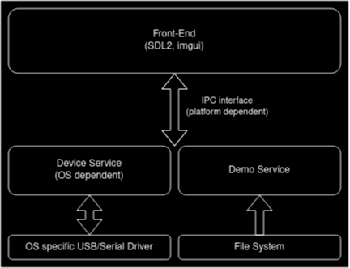

# ECG Monitor App

desktop app for my ECGMonitor hardware



# Building

## Dependencies

- GNU/Linux machine

- compiler with C++20 support (gcc/clang)

- CMake 3.20

- GNU Make or Ninja

- SDL2

## Steps

1.
```
mkdir build && cd build
```

2.
```
cmake ..
```

3.
```
make -j`nproc`
```

4.
```
./ecgm_app
```
